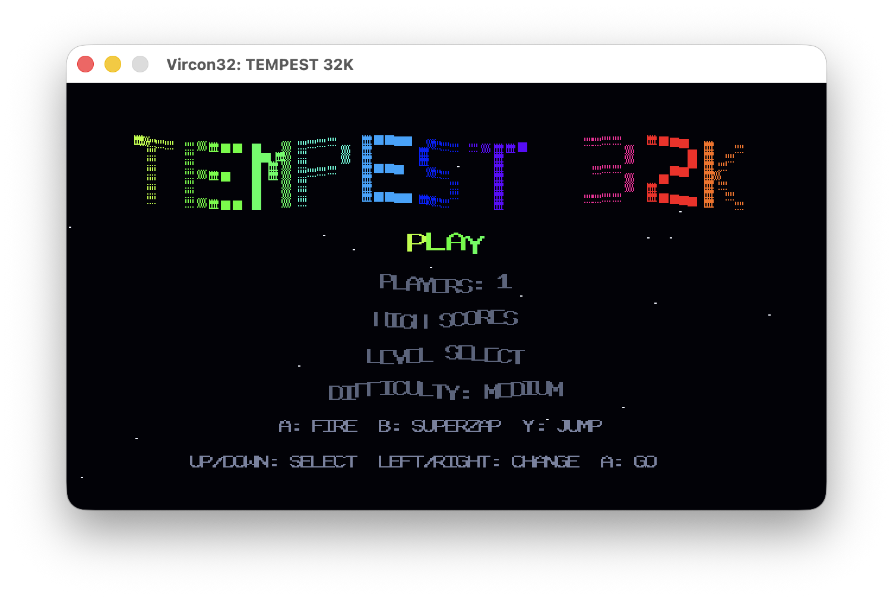
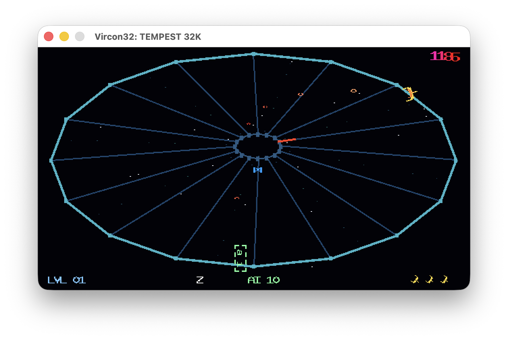
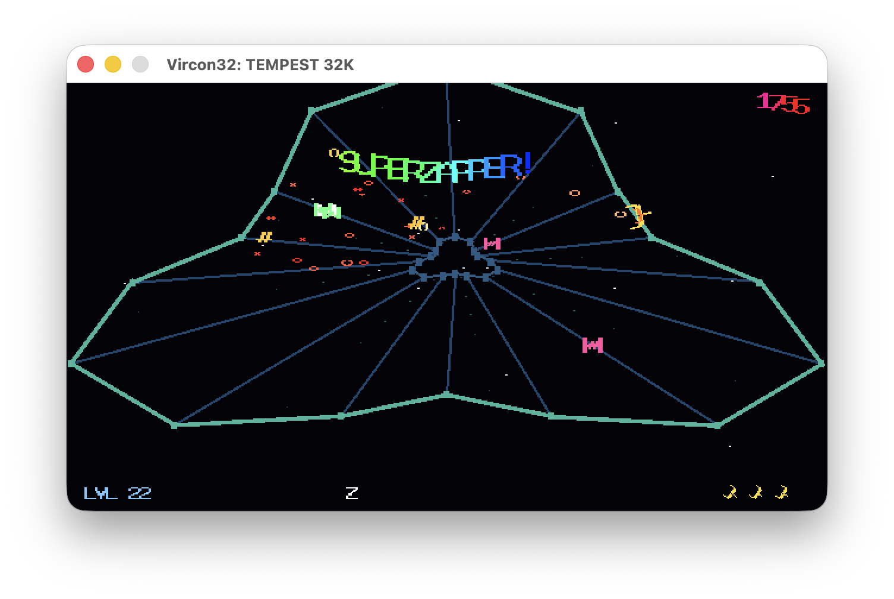
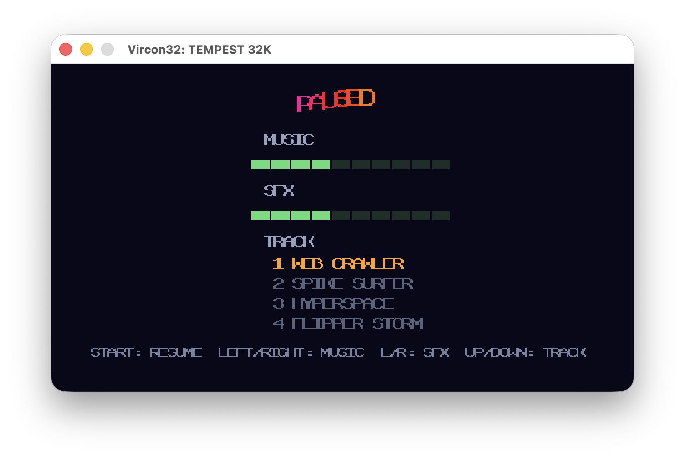

# v32roms

Collection of Vircon32 CARTs

## Tempest 32K

a    clone    of    Atari's     Tempest/Tempest    2000,    written    in
C++,    serving   as    a   demo    of   the    functionality   of    the
[v32c++](https://github.com/wedge1020/v32cxx) transpiler,  optimized with
the [v32opt](https://github.com/wedge1020/v32opt) assembly optimizer.

Download: [Tempest32K.v32](Tempest32K/Tempest32K.v32)

